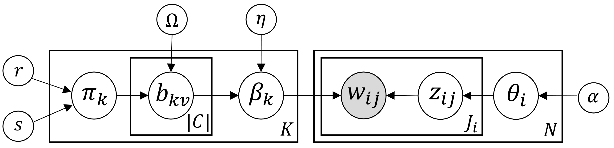

<!-- # **B**ayesian **r**econstruction of **e**xcised **m**RNA (BREM) -->
# **B**ayesian Reconstruction and Differential Testing of Excised Introns

*Authors:* <br/>
Marjan Hosseini<br/>
Devin J. McConnell<br/>
Derek Aguiar

The code for BSEEJ method is provided in 'bseej.py' file.
The compressed version of junction files for one example gene (A2ML1) is added in the github.
To run BSEEJ with default configurations, simply run the requirements.txt.
Then run 'bseej.py'. More detailed guide is the follow. 


## Usage
1. Clone the repository:
```sh
git clone https://github.com/bayesomicslab/BSEEJ.git
cd BSEEJ
```

2. Install the project dependencies and activate the environment:
```sh
conda env create -f bseej_env.yml
conda activate bseej_env
```

3. Run the code:
```sh
python3 bseej.py
```

Or alternatively for changing model parameters or training other genes run:
 
```sh
python3 bseej.py -k clusters_no -i max iteration  -e eta hyper parameter -a alpha hyper-parameter -r r -s s -p junction_path -g gene_name -o results_path
```
    - clusters_no: number of clusters, this number should be larger than the number of minimum node cover of the interval graph of the intron excisions
    - max iteration: the maximum number of iterations for the Gibbs updates
    - eta corresponds to eta hyper-parameter (See the model section)  
    - alpha corresponds to alpha hyper-parameter (See the model section)  
    - r corresponds to r hyper-parameter (See the model section)  
    - s corresponds to s hyper-parameter (See the model section) 
    - junction_path is the relative or full path to the folder that contains the junctions reads. Here one gene (A2ML1.zip) has been uploaded for example to be run and it should first unzip and then give the extracted path to the code.
    - gene: the name of the gene (Here by default, gene is A2ML1).


## Prepare the input:

#### [STAR](https://code.google.com/archive/p/rna-star/)
For creating the EGA and simulated data BAM files we ran the [STAR](https://academic.oup.com/bioinformatics/article/29/1/15/272537) [1] aligner for fast and accurate alignment. 
```sh
STAR --runThreadN 20 --genomeDir ../genome_data/genome_index/ --outFileNamePrefix ./person_${i}_ --twopassMode  Basic --outSAMstrandField intronMotif --outSAMtype BAM SortedByCoordinate  --readFilesIn ${1}/person_${i}_1.fa ${1}/person_${i}_2.fa
```
In this example $\${1}$ is the directory where the files are located. 
The input file 'person\_*\_1.fa' is a collection of genes for the ith sample on forward sequence and the second is the collection of genes on the backward sequence.
This allows us to use the twopassMode and we also used the intronMotif in order to obtain spliced alignments (XS).
Once the files have been aligned they are then separated out into the individual bam files of just one gene to work on at a time.

#### [Regtools](https://regtools.readthedocs.io/en/latest/)
[Regtools](https://www.biorxiv.org/content/biorxiv/early/2021/01/05/436634.full.pdf) [2] was used for an efficient filtering of the junctions.
```sh
regtools junctions extract -s 0 -a 6 -m 50 -M 500000 %s -o %s.junc  
```
Here the two \%s are the bam file and output name respectively.
On all data used in this project, EGA, Geuvadis, and simulations, we used the following flags:

    * -s: finds XS/unstranded flags
    * -a: minimum anchor length into exon (6 bp)
    * -m: minimum intron size (50 bp)
    * -M: Maximum intron size (500000 bp)


#### [Portcullis](https://portcullis.readthedocs.io/en/latest/)
```sh
portcullis prep -t 20 -v --force -o %s_portcullis/1-prep/ GRCh38.primary_assembly.genome.fa %s/%s.bam
```

First step of [portcullis](https://academic.oup.com/gigascience/article/7/12/giy131/5173486) [3] is prep and it takes in the fasta file from the reference genome used, here is an example from the data simulations.
It is important to note that portcullis was run on our simulations and both experimental results.
Here \%s is there name of the folder to direct output to and the bam file name.
```sh
portcullis junc -t 20 -v -o %s_portcullis/2-junc/portcullis_all --intron_gff %s_portcullis/1-prep/    
```

The next step that is being done is extraction of the junctions into a gff format. 
Here \%s is just giving it the name of the folder to look into.

```sh
portcullis filt -t 20 -v -n --max_length 500000 --min_cov 30 -o %s_portcullis/3-filt/portcullis_filtered --intron_gff %s_portcullis/1-prep/ %s_portcullis/2-junc/portcullis_all.junctions.tab
```
Finally, we set some filtering using portcullis. 
We only keep introns that have a max length of 500000, do not use the machine learning filtering, and have a minimum coverage of 30.
Here again \%s is just point to the gene folder to look into for the files.
After portcullis is complete we do an overlap check between the junctions found from regtools and portcullis and only keep the ones that overlap with at least 90%.


## Model:

**BREM Probabilistic Graphical Model** 
<br/><br/>
 
<br/><br/>

Main **variables and parameters** include:
* V is the set of unique intron excisions, indexed by v and its size of denoted by |V|.
* N is the number of samples and are indexed by i.
* J<sub>i</sub> is the number of intron excisions in i<sup>th</sup> sample. 
* K is the number of clusters (indexed by k).
* For the j<sup>th</sup> intron excision in the i<sup>th</sup> sample, we assign a cluster k. 
* Graph G = (V, E), where V is the set of unique intron excision and there is an edge between two intron excisions _iff_ they intersect each other.
* &Omega; is the set of all the independent sets in G.

* r, s are priors for &pi; (Beta distribution):
<br/><br/>

<br/><br/>
    * Increase in mean of Beta(r,s) results in increase in cluster size |SIE|.


* The structure of a (clusters) SIEs consists of the inclusion or exclusion of intron excisions.  
<br/><br/>

<br/><br/>


* For cluster k, &beta;<sub>k</sub> is a |V|-dimensional Dirichlet which represents the distribution of the cluster k over the intron excisions.
<br/><br/>

<br/><br/>
    * &eta; = (&eta;<sub>1</sub>, &eta;<sub>2</sub>, ..., &eta;<sub>|V|</sub>) is &beta; variable prior.


* For the i<sup>th</sup> sample, variable &theta;<sub>i</sub> is a K-dimensional Dirichlet distribution and represents the proportions of the clusters in sample i.
<br/><br/>

<br/><br/>
    * &alpha; = (&alpha;<sub>1</sub>, &alpha;<sub>2</sub>, ..., &alpha;<sub>N</sub>) is &theta; variable prior.

* Variable z<sub>ij</sub> is the cluster assignment for j<sup>th</sup> intron excision in i<sup>th</sup> sample. It can take a natural value between 1 and K and follows a Multinomial:
<br/><br/>

<br/><br/>

* In the ith sample, the jth intron excision is w<sub>ij</sub> and is observed and follows a Multinomial distribution:
<br/><br/>

<br/><br/>

## References
[1] Dobin, A., Davis, C. A., Schlesinger, F., Drenkow, J., Zaleski, C., Jha, S., ... & Gingeras, T. R. (2013). STAR: ultrafast universal RNA-seq aligner. Bioinformatics, 29(1), 15-21.

[2] Feng, Y. Y., Ramu, A., Cotto, K. C., Skidmore, Z. L., Kunisaki, J., Conrad, D. F., ... & Griffith, M. (2018). RegTools: Integrated analysis of genomic and transcriptomic data for discovery of splicing variants in cancer. BioRxiv, 436634.

[3] Mapleson, D., Venturini, L., Kaithakottil, G., & Swarbreck, D. (2018). Efficient and accurate detection of splice junctions from RNA-seq with Portcullis. GigaScience, 7(12), giy131.
